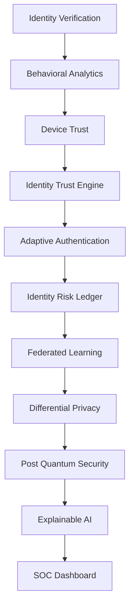

# FedShield-ID: Privacy-First Identity Trust Platform for Banking Networks

FedShield-ID is a Privacy-First Identity Trust Platform designed for banking networks. The system continuously validates customer and enterprise identities using Behavioral Analytics, Device Trust Intelligence, Adaptive Authentication, Federated Learning, Differential Privacy, Explainable AI, and Post-Quantum Security.

The platform dynamically generates Identity Trust Scores and triggers verification only when elevated risk conditions are detected.

---

## 🧱 System Architecture & Trust Workflow

The platform continually processes and updates identity trust metrics through a multi-layered, privacy-first pipeline:



---

## 🚀 Key Features

FedShield-ID is designed specifically to address complex banking security challenges, organized around the following prioritized core modules:

### 1. Onboarding Identity Verification & Synthetic ID Prevention
- **Regulatory Integrity Checks**: Validates identity credentials (such as Permanent Account Number - PAN) format patterns.
- **Synthetic ID Flagging**: Evaluates profile inconsistencies (email/PAN mismatch, disposable tempmail domains check, and VoIP carrier detection).
- **KYC Tampering Detection**: Highlights indicators of corrupted digital signatures or manipulated onboarding documents.

### 2. Continuous Identity Trust Scoring
- **Composite Scoring**: Dynamically computes user trust and risk scores based on historical profiles, geo-distance drift, and volume anomalies.
- **Explainable Trust Boundaries**: Maps attributions of session metrics to confirm identity parameters.

### 3. Behavioral Analytics & Biometrics
- **Biometric Telemetry**: Captures keyboard typing speed (keys/min), mouse movement jitter, and average click latency to establish a behavioral signature.
- **Biometric Anomaly Detection**: Flags instances of robotic click/typing speeds (e.g., automated credential stuffing or bot sweeps) in real-time.

### 4. Device Trust Intelligence
- **Device Reputation**: Checks operating system posture (rooted/emulated status), unrecognized browser signatures, and blacklisted network targets.
- **Device Verification Status**: Audits hardware ID clusters to detect resource-sharing anomalies.

### 5. Adaptive Authentication (Risk-Based Auth Engine)
- **Granular Auth Verdicts**: Implements dynamic authentication challenge rules mapped directly to individual trust scores:
  - **Trust Score > 90**: Frictionless Login allowed (normal biometric, device, and recovery parameters).
  - **Trust Score 70–90**: Prompt for standard One-Time Password (OTP) verification.
  - **Trust Score 50–70**: Step-Up Authentication challenge (triggered by minor location deviation or transaction spikes).
  - **Trust Score 20–50**: Live Face Verification required (for significant behavioral biometrics or device anomalies).
  - **Trust Score < 20**: Block Access (robotic inputs, blacklisted VPNs, or critical credentials failure).

### 6. SIM Swap & Suspicious Account Recovery Audits
- **SIM Swap Tracking**: Automatically flags recovery requests initiated within 72 hours of a telecommunication SIM card swap.
- **Geo-Recovery Anomalies**: Monitors recovery geolocations that deviate from the primary customer account profile history.
- **Credential Stuffing Prevention**: Tracks failed login attempts in the immediate pre-recovery window, auto-escalating block rules.

### 7. Insider Threat Detection & Privileged Access Monitoring
- **Out-of-Hours Monitoring**: Audits administrator actions occurring outside standard working hours (8:00 AM - 7:00 PM).
- **Spike Downloads Auditor**: Inspects large queries or database exports targeting customer Personal Identifiable Information (PII) vaults.
- **Privilege Escalation Tracing**: Maintains comprehensive database activity audits for credential abuse and permission deviations.

### 8. Privacy-Preserving Federated Learning
- **Decentralized Training**: Models 3 independent bank nodes (Bank A: Retail, Bank B: Premium Cards, Bank C: Savings) training ML classifiers on local datasets without data pooling.
- **FedAvg Aggregation**: A central aggregator performs Federated Averaging to output a collaborative global model.

### 9. Differential Privacy (DP)
- **Laplacian Noise Injection**: Injects noise into model weights before transmission, controlled by a configurable privacy budget ($\epsilon$), mathematically preventing member database reconstruction.

### 10. Post-Quantum Security
- **Simulated Crystals-Kyber KEM**: Simulates CRYSTALS-Kyber-768 Key Encapsulation Mechanism (KEM) to securely exchange symmetric key materials.
- **AES-256-GCM Payload Protection**: Encrypts model weights during federated averaging rounds using post-quantum shared secrets.
- **Speed & Cryptographic Benchmarks**: Measures execution speed and payload sizes of Kyber-768 compared to classical RSA-3072 and ECDH-secp256r1.

### 11. Explainable AI (SHAP) & GenAI Forensics
- **Explainable Decision Boundaries**: Computes Shapley attribution values for transaction parameters, rendering a horizontal bar chart of positive/negative risk contributors.
- **GenAI Forensic Reports**: Generates detailed natural language briefs compiling PAN validity, SIM swap logs, biometrics, and threat explanations for compliance audits.

### 12. Identity Risk Ledger
- **Live Ledger Feed**: Streams incoming transactions to regional ledgers in real-time, verifying identity clearances and logging threat alerts.
- **Relationship Analyzer (Knowledge Graph)**: Highlights shared devices or IP addresses across distinct customer profiles to expose money laundering velocity.

---

## 🛠️ Tech Stack

- **Backend**: Python 3.10+, FastAPI (Asynchronous framework), SQLAlchemy ORM, Uvicorn server.
- **Machine Learning & XAI**: Scikit-Learn (SGD & Random Forest Classifiers), NumPy, Pandas, SHAP (Linear Formulation).
- **Cryptography**: Simulated CRYSTALS-Kyber-768 KEM, Python cryptography library (AES-GCM, ECDH, RSA).
- **Database**: SQLite (local single-file prototyping) & PostgreSQL (Docker production setup).
- **Frontend**: React 18, Vite (fast HMR bundling), Tailwind CSS (responsive layouts), Chart.js (via react-chartjs-2), Lucide React icons.

---

## 📂 Project Structure

```
FedShield-ID/
├── backend/
│   ├── app/
│   │   ├── identity/
│   │   │   └── identity_verification.py  # PAN checks, VoIP/tempmail domains, KYC consistency
│   │   ├── ml/
│   │   │   ├── train.py                 # Local training models wrapper (RF & SGD)
│   │   │   ├── federated.py             # FedAvg weight aggregator with DP noise
│   │   │   ├── trust_score.py           # Multi-dimensional Trust & Risk score engine
│   │   │   └── shap_explainer.py        # Explainable AI (SHAP attributions & text generator)
│   │   ├── security/
│   │   │   ├── account_recovery.py      # Account recovery checks (SIM Swap, Geo-Recovery)
│   │   │   ├── adaptive_auth.py         # Dynamic Risk-Based Authentication (RBA) engine
│   │   │   ├── insider_threat.py        # Insider threat monitoring & privileged access checks
│   │   │   └── pqc.py                   # Crystals-Kyber-768 KEM & cryptography benchmarks
│   │   ├── utils/
│   │   │   ├── data_generator.py        # Synthetic transactions & security log seeder
│   │   │   ├── genai_investigator.py    # Generates GenAI analyst briefings for incidents
│   │   │   └── graph_builder.py         # Builds graph node/edge JSON for visualizer
│   │   ├── database.py                  # SQLAlchemy models, SQLite & Postgres database setup
│   │   └── main.py                      # FastAPI routes, simulator threads & initialization
│   ├── Dockerfile
│   └── requirements.txt
├── frontend/
│   ├── src/
│   │   ├── components/
│   │   │   └── Sidebar.jsx              # Navigation layout with system health alerts
│   │   ├── pages/
│   │   │   ├── Overview.jsx             # Metrics overview, threat levels, and bank node details
│   │   │   ├── TrustIntelligence.jsx    # Flagship customer profile trust explorer & RBI indicators
│   │   │   ├── IdentityVerification.jsx # Onboarding audit logs, PAN consistency checks
│   │   │   ├── FraudDetection.jsx       # Identity Risk Ledger & simulator control dashboard
│   │   │   ├── FederatedMonitor.jsx     # Orchestrates federated learning rounds & DP budgets
│   │   │   ├── Explainability.jsx       # Linear SHAP chart representations & compliance auditing
│   │   │   ├── SecurityDashboard.jsx    # Crystals-Kyber benchmark graphs & KEM debugger
│   │   │   ├── ComplianceDashboard.jsx  # RBI Checklist, Insider threat reports, recovery audits
│   │   │   └── KnowledgeGraph.jsx       # Interactive SVG showing collision clusters
│   │   ├── App.jsx                      # App routes, polling updates, and centralized API calls
│   │   ├── index.css                    # Custom CSS variables, neon dark theme styles
│   │   └── main.jsx
│   ├── Dockerfile
│   ├── tailwind.config.js
│   └── package.json
├── docker-compose.yml
└── README.md
```

---

## 📊 Database Schema

### 1. `transactions`
Logs all incoming and evaluated customer activities.
- `id` (Integer, Primary Key)
- `bank` (String): Origin node (Bank A, B, C)
- `amount` / `merchant` / `distance_from_home` / `location_deviation`
- `device_id` / `ip_address` / `pan_number` / `customer_name` / `phone_number` / `email_address`
- `device_trust_score` (Float, 0–100)
- `typing_speed` / `mouse_jitter` / `click_speed` / `failed_login_count`
- `trust_score` / `risk_score` (Float, 0–100)
- `identity_confidence_score` / `kyc_risk_score` / `synthetic_identity_score`
- `recovery_risk_score` / `insider_risk_score`
- `auth_action` / `auth_reason` (Adaptive Auth decisions)
- `prediction` (Integer: 0 = Legitimate, 1 = Fraud Alert)
- `is_flagged` (Boolean)
- `xai_explanation` (Text JSON): SHAP values and natural text briefs

### 2. `user_profiles`
Maintains persistent trust scores and verification baselines.
- `customer_id` (Integer, Primary Key)
- `customer_name` / `pan_number` / `phone_number` / `email_address`
- `trust_score` / `risk_score` / `device_reputation` / `login_consistency`
- `avg_typing_speed` / `avg_click_speed` / `avg_mouse_jitter`
- `identity_confidence_score` / `recovery_risk_score` / `insider_risk_score`
- `risk_category` (String: Trusted, Low, Medium, High Risk)
- `auth_history_json` (Text JSON)

### 3. `employee_activity_logs`
Tracks database logins, queries, and security threats from bank personnel.
- `id` (Integer, Primary Key)
- `employee_id` / `employee_name` / `action` / `resource` / `ip_address` / `device_id`
- `is_suspicious` (Boolean)
- `risk_score` (Float)
- `details` (Text)

### 4. `graph_nodes` & `graph_edges`
Used by the relationship analyzer to index linkage records.
- `GraphNode`: `id` (String Primary Key), `label` (String), `properties_json` (Text)
- `GraphEdge`: `id` (Integer Primary Key), `source` (String), `target` (String), `type` (String)

### 5. `federated_rounds`
Records global aggregates and differential privacy configurations.
- `round_number` (Integer, Primary Key)
- `global_accuracy` / `global_loss` / `bank_a_accuracy` / `bank_b_accuracy` / `bank_c_accuracy`
- `privacy_budget_epsilon` / `noise_added` / `encryption_mode`

### 6. `security_logs`
Cryptographic benchmark history logs.
- `id` (Integer, Primary Key)
- `node_name` / `action` / `algorithm` / `bytes_transmitted` / `execution_time_ms` / `encryption_status`

---

## 🔌 API Endpoints Documentation

### SOC Metrics & Configuration
- `GET /dashboard-metrics`: Aggregates active transactions, identity risk percentage, global model accuracy, and real-time bank data distribution stats.
- `GET /compliance-status`: Compiles scores against specific RBI checklists, including Federated learning, data isolation, and adaptive authentication statuses.
- `GET /privacy-status`: Returns differential privacy parameters, Laplacian noise history, and privacy budget indicators.
- `GET /security-status`: Displays post-quantum keypair exchange logs, active quantum-safe tunnels, and real-time ECDH/RSA speed benchmarks.

### Ingestion & Attack Simulator
- `POST /stream-transactions?active={bool}`: Toggles the background transaction generator that injects a new transaction log every 3 seconds.
- `POST /simulate-attack`: Injects specific attack patterns (`Transaction Fraud`, `Account Takeover`, `Synthetic Identity Fraud`, `Bot Attack`, `Suspicious Recovery`, `Insider Threat`) into targeted bank nodes to verify dashboard reactions.

### Core Scoring & Audits
- `GET /transactions`: Query paginated transactions, filterable by Bank origin and Flagged status.
- `POST /predict`: Scores single transaction payloads, updating the ledger with SHAP explanations and trust indicators.
- `GET /explain/{tx_id}`: Retrieves computed SHAP values and natural language reasoning text for a specific transaction.
- `GET /fraud-investigation/{tx_id}`: Compiles a detailed GenAI forensic brief analyzing identity trust status, behavioral biometrics, and compliance risks.

### Trust Profiles & Identity Checks
- `GET /trust-score`: Lists persistent user profiles with typing metrics and risk rankings.
- `GET /identity-verification`: Audit page list verifying PAN formatting, email domain reputation, and telephone carrier VoIP flags.
- `POST /verify-identity`: Live check evaluating onboarding parameters for disposable emails or invalid formats.
- `GET /insider-threats`: Lists bank administrator activity logs, flagging off-hour downloads or escalation alerts.
- `GET /recovery-events`: Monitors SIM Swap indicators and unrecognized device recovery geolocations.
- `GET /graph-data`: Compiles relationship nodes and edges for the SVG graph.

---

## ⚡ Quick Setup & Running Guide

### Method A: Docker Compose (Recommended - PostgreSQL Environment)

Ensure Docker and Docker Desktop are running on your host machine.

1. Open a terminal in the project root directory.
2. Run the build command:
   ```bash
   docker-compose up --build
   ```
3. Access components:
   - **React Dashboard**: [http://localhost:3000](http://localhost:3000)
   - **FastAPI Documentation**: [http://localhost:8000/docs](http://localhost:8000/docs)
4. Shutdown containers:
   ```bash
   docker-compose down
   ```

### Method B: Manual Local Running (SQLite Fallback - Zero Config)

#### Step 1: Launch Backend (FastAPI)
1. Navigate to the `backend/` directory:
   ```bash
   cd backend
   ```
2. Create and activate a Python virtual environment:
   ```bash
   python -m venv venv
   # Windows (PowerShell):
   .\venv\Scripts\Activate.ps1
   # macOS/Linux:
   source venv/bin/activate
   ```
3. Install dependencies:
   ```bash
   pip install -r requirements.txt
   ```
4. Start the Uvicorn server:
   ```bash
   # Standard:
   uvicorn app.main:app --reload
   # Windows with execution policies:
   python -m uvicorn app.main:app --reload
   ```
   *Backend is running on [http://localhost:8000](http://localhost:8000)*.

#### Step 2: Launch Frontend (Vite)
1. Open a new terminal and navigate to `frontend/`:
   ```bash
   cd frontend
   ```
2. Install package dependencies:
   ```bash
   npm install
   ```
3. Start the local Vite development server:
   ```bash
   npm run dev
   ```
   *Frontend is running on [http://localhost:5173](http://localhost:5173)*.

---

## 🏆 Demo Walkthrough Guide (For Hackathon Pitch)

Present the platform step-by-step to answer the core question: **"Can this identity be trusted right now?"** rather than simply asking *"Is this transaction fraudulent?"*:

1. **Onboarding Identity Auditing (First Line of Defense)**:
   - Navigate to the **Identity Verification** page.
   - Show how the platform validates PAN cards, disposable email services, and VoIP phone carrier logs to audit synthetic accounts at inception.
2. **Continuous Biometric Trust Verification (Flagship Hub)**:
   - Navigate to the **Trust Intelligence** flagship dashboard.
   - Select a low-risk client (e.g., *Amaan Sharma*) and contrast them with a compromised account (e.g., *Sanjay Dutt*).
   - Show how the gauge and biometrics radar identify robotic mouse/typing patterns, and highlight the **Trust Verdict Basis** panel that explains *why* the user is trusted or blocked.
3. **Insider Threats & SIM Swap Recoveries**:
   - Go to the **Compliance Checklist** panel.
   - Point out the **Insider Threat Audit Logs** (revealing *Rajesh Sen's* off-hour database query dumps) and **SIM Swap Telemetry Logs** (showing recoveries requested immediately after SIM modifications).
   - Review the RBI Standards compliance score dial.
4. **Decentralized Parameter Orchestration (Federated Learning & DP)**:
   - Navigate to the **Federated Monitor** tab.
   - Adjust the **Differential Privacy** slider ($\epsilon = 1.5$) and click **Trigger Federated Round**. Show how the banks collaboratively exchange weight updates without data pooling.
5. **Key Encapsulation handshakes (Post-Quantum Security)**:
   - Navigate to the **Security Panel** tab to inspect the Kyber-768 KEM handshake debugger, showing public keys and shared secrets compared to classical RSA/ECDH speeds.
6. **XAI Audit Trail (SHAP) & GenAI Forensics**:
   - Navigate to the **Explainable AI** tab.
   - Select a high-risk alert. Show the SHAP chart mapping exactly how each feature influenced the AI model's score.
   - Show the GenAI briefing which formats issues around *Identity Trust Status*, *Detected Issues*, and *Recommended Action* rather than generic fraud scores.
7. **Interactive Relationship Analyzer (Knowledge Graph)**:
   - Go to the **Knowledge Graph** tab.
   - Select node **CUST_4** (*Sanjay Dutt*). Point out the cluster showing that 3 distinct customer names share a single device ID (*DEV_FRAUD*) and VPN IP address, proving the platform detects collusive risk networks.
8. **Continuous Risk Ledger Feed (Identity Risk Ledger)**:
   - Navigate to the **Identity Risk Ledger**.
   - Click **Start Live Stream** and show real-time transactions streaming. Point out how the composite Trust Scores update dynamically.

> [!NOTE]
> **Core Principle**: FedShield-ID evaluates the continuous trustworthiness of the *identity*, not just isolated transaction events.  
> 
> *Trust Every Identity. Verify Only When Risk Demands.*

