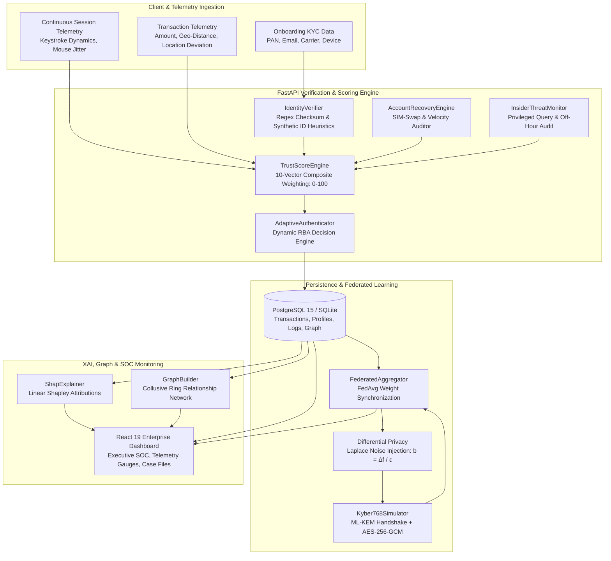
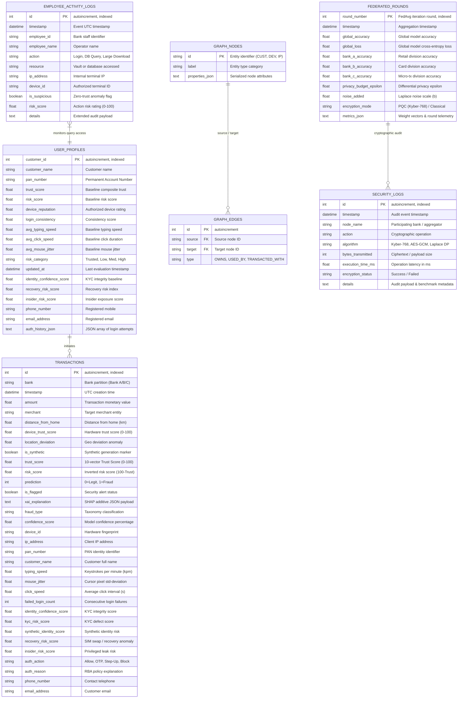

# FedShield-ID: Privacy-First Identity Trust Platform for Banking Networks
[](https://www.docker.com/)
[](https://react.dev/)
[](https://fastapi.tiangolo.com/)
[](https://www.postgresql.org/)
[](https://csrc.nist.gov/Projects/post-quantum-cryptography)

**Author:** Mohd. Amaan Hamid  
**Academic Qualification:** MSc Cybersecurity  
**Contact:** [hamidamaan3@gmail.com](mailto:hamidamaan3@gmail.com)  
**Repository Architecture:** Distributed Privacy-Preserving Identity Trust, Behavioral Telemetry, and Risk-Based Adaptive Authentication  

---

## 1. Executive Summary & Problem Statement

Modern financial institutions face an escalating dilemma: traditional point-in-time perimeter authentication (such as static passwords or SMS-based One-Time Passwords) fails against modern identity threats, including **Synthetic Identity Fraud (SIF)**, **Account Takeover (ATO)** via SIM-swapping, automated **credential stuffing bots**, and **insider data harvesting**. Concurrently, stringent regulatory frameworks (e.g., RBI Master Directions on Digital Payment Security, GDPR, and ISO/IEC 27001) prohibit centralized aggregation or unauthorized pooling of customer personal identifiable information (PII).

**FedShield-ID** addresses this challenge through a **continuous, privacy-preserving identity trust engine**. Instead of treating identity verification as a binary gateway event at login, FedShield-ID continuously computes a composite **Identity Trust Score (0–100)** across multiple risk vectors. It trains anomaly detection models across isolated banking partitions using **Federated Learning (FedAvg)** and **Differential Privacy (Laplace Mechanism)**, secures gradient exchanges with simulated **Post-Quantum Key Encapsulation (CRYSTALS-Kyber-768 / ML-KEM)**, delivers local decision transparency via **Linear SHAP Attributions**, and uncovers collusive fraud rings using an in-memory **Entity Knowledge Graph**.

---

## 2. Core Objectives & Design Principles

* **Continuous Identity Evaluation**: Identity trustworthiness is assessed continuously across behavioral biometrics, session posture, and transaction drift rather than solely during session initiation.
* **Zero Raw Data Pooling**: Training data remains strictly partitioned within local banking domains; only mathematically perturbed gradient weights are exchanged.
* **Risk-Proportional Friction**: Authentication friction is applied dynamically through Risk-Based Adaptive Authentication (RBA), allowing frictionless access for trusted clients while enforcing multi-factor challenges or immediate session termination for high-risk anomalies.
* **Explainability by Design**: Every flagged anomaly is attributed to specific input deviations using additive Shapley values, producing structured compliance-ready audit trails.
* **Post-Quantum Preparedness**: Cryptographic parameter exchange anticipates quantum cryptanalytic threats (Shor’s and Grover’s algorithms) by modeling lattice-based Key Encapsulation Mechanisms.
* **Enterprise Ergonomics**: An operational Security Operations Center (SOC) user experience built on a refined, accessible light skeuomorphic design system.

---

## 3. Verified System Architecture

The following diagram illustrates the verified end-to-end data processing pipeline, tracing incoming identity telemetry through feature processing, trust scoring, adaptive challenge derivation, decentralized model aggregation, and SOC monitoring.


```mermaid
graph TD
    subgraph ClientLayer [Client & Telemetry Ingestion]
        T1[Onboarding KYC Data\nPAN, Email, Carrier, Device]
        T2[Continuous Session Telemetry\nKeystroke Dynamics, Mouse Jitter]
        T3[Transaction Telemetry\nAmount, Geo-Distance, Location Deviation]
    end

    subgraph EvaluationEngine [FastAPI Verification & Scoring Engine]
        V1[IdentityVerifier\nRegex Checksum & Synthetic ID Heuristics]
        V2[AccountRecoveryEngine\nSIM-Swap & Velocity Auditor]
        V3[InsiderThreatMonitor\nPrivileged Query & Off-Hour Audit]
        
        TE[TrustScoreEngine\n10-Vector Composite Weighting: 0-100]
        AA[AdaptiveAuthenticator\nDynamic RBA Decision Engine]
    end

    subgraph DataAndPrivacy [Persistence & Federated Learning]
        DB[(PostgreSQL 15 / SQLite\nTransactions, Profiles, Logs, Graph)]
        FL[FederatedAggregator\nFedAvg Weight Synchronization]
        DP[Differential Privacy\nLaplace Noise Injection: b = Δf / ε]
        PQC[Kyber768Simulator\nML-KEM Handshake + AES-256-GCM]
    end

    subgraph AnalyticsAndSOC [XAI, Graph & SOC Monitoring]
        SHAP[ShapExplainer\nLinear Shapley Attributions]
        KG[GraphBuilder\nCollusive Ring Relationship Network]
        SOC[React 19 Enterprise Dashboard\nExecutive SOC, Telemetry Gauges, Case Files]
    end

    T1 --> V1
    T2 --> TE
    T3 --> TE
    V1 --> TE
    V2 --> TE
    V3 --> TE

    TE --> AA
    AA --> DB
    DB --> SHAP
    DB --> KG
    DB --> FL

    FL --> DP
    DP --> PQC
    PQC --> FL

    SHAP --> SOC
    KG --> SOC
    DB --> SOC
    FL --> SOC
```

---

## 4. Methodological Foundations & Detailed Algorithms

### 4.1. Identity Trust Scoring Methodology

The `TrustScoreEngine` computes a composite score $T \in [0, 100]$ across 10 normalized dimensions. A corresponding Risk Score is defined as $R = 100 - T$.

$$\text{Trust Score} = \sum_{i=1}^{10} w_i \cdot S_i$$

$$\sum_{i=1}^{10} w_i = 1.0$$

| Dimension ($i$) | Weight ($w_i$) | Input Parameter | Mathematical Formulation / Evaluation Logic |
|:---|:---:|:---|:---|
| **Device Reputation** | $0.10$ | `device_trust_score` | Direct normalized score $S_1 \in [0, 100]$ (baseline hardware trust). |
| **Login Consistency** | $0.10$ | `failed_login_count` | $S_2 = \max(0.0, 100.0 - 20.0 \times \text{failed\_logins})$. |
| **Geolocation Consistency** | $0.10$ | `distance_from_home` | $S_3 = \max(0.0, 100.0 - 12.0 \times \ln(\text{distance} + 1))$. |
| **Transaction Volume** | $0.10$ | `amount`, `avg_amount` | Ratio $r = \frac{\text{amount}}{\max(1.0, \text{avg\_amount})}$. If $r \le 1.2 \implies 100$; else $\max(0.0, 100.0 - (r - 1.2) \times 20.0)$. |
| **Behavioral Biometrics** | $0.20$ | `typing_speed`, `mouse_jitter`, `click_speed` | Penalty-based: Typing $>300$ kpm ($-40$), $<40$ kpm ($-15$); Jitter $<0.1$ px ($-40$, robotic), $>8.0$ px ($-20$); Click $<0.05$ s ($-40$). $S_5 = \max(0, 100 - \sum \text{penalties})$. |
| **Identity Verification** | $0.15$ | `identity_confidence_score` | Derived from onboarding KYC checks: PAN format, tempmail, carrier. |
| **Account Recovery Status** | $0.10$ | `recovery_risk_score` | $S_7 = \max(0.0, 100.0 - \text{recovery\_risk})$. Penalizes SIM swaps $<72$h. |
| **Insider Threat Status** | $0.05$ | `insider_risk_score` | $S_8 = \max(0.0, 100.0 - \text{insider\_risk})$. Penalizes off-hour PII access. |
| **Active Session Risk** | $0.05$ | `session_risk_score` | $S_9 = \max(0.0, 100.0 - \text{session\_risk})$. Evaluates VPNs and emulated devices. |
| **Authentication History** | $0.05$ | `auth_penalty` | $S_{10} = \max(0.0, 100.0 - \text{auth\_penalty})$. Historical challenge failure rate. |

#### Risk Categories
* **Trusted**: $T \ge 90.0$
* **Low Risk**: $70.0 \le T < 90.0$
* **Medium Risk**: $50.0 \le T < 70.0$
* **High Risk**: $T < 50.0$

---

### 4.2. Risk-Based Adaptive Authentication (RBA) Engine

The `AdaptiveAuthenticator` evaluates the calculated Trust Score and aggregates session risks (flagged Tor/VPN IP ranges `185.220.101.4`, headless browser signatures `dev_headless_chrome`, and biometric alerts) to determine real-time authentication decisions.

An adjusted score is derived:

$$T_{\text{adj}} = \max(0.0, T - 0.3 \times \text{SessionRisk})$$

| Adjusted Score ($T_{\text{adj}}$) | Enforcement Action | Operational Rationale | Classification |
|:---:|:---|:---|:---|
| **$> 90.0$** | **Allow Login** | Biometric, device, and recovery telemetry matches standard profile. Frictionless login permitted. | Trusted |
| **$70.0 - 90.0$** | **OTP Verification** | Minor shift in device reputation or typing dynamics. Standard One-Time Password challenge. | Low Risk |
| **$50.0 - 69.9$** | **Step-Up Authentication** | Anomalous transaction volume or location deviation. Multi-factor challenge enforced. | Medium Risk |
| **$20.0 - 49.9$** | **Face Verification** | Significant behavioral biometrics anomaly or suspicious recovery indicator. Biometric match required. | High Risk |
| **$< 20.0$** | **Block Access** | Robotic input signature, known malicious IP, or critical credential inconsistency. Session terminated. | Critical Threat |

> **Implementation Note:** In the current prototype architecture, the authentication verdict is returned as an authoritative API decision attribute (`auth_action` and `auth_reason`) stored in the transaction ledger and rendered in the dashboard. In a production enterprise deployment, this decision would gate session tokens via an identity provider (e.g., Keycloak, Ping Identity, or Okta).

---

### 4.3. Identity Verification & KYC Integrity Heuristics

The `IdentityVerifier` audits onboarding and identity verification parameters using deterministic checks and pattern matching:

1. **PAN Format Check**: Validates Indian Permanent Account Number (PAN) structure using regex `^[A-Z]{5}[0-9]{4}[A-Z]$`. Checks format validity (30-point deduction if malformed).
2. **Email Domain Reputation**: Checks domain against known disposable email providers (`tempmail.com`, `yopmail.com`, `mailinator.com`, `guerrillamail.com`). Flags disposable domains with a 90% risk rating.
3. **Telecom Carrier & VoIP Audit**: Identifies malformed phone strings ($<10$ digits) and known virtual VoIP prefix ranges (`91000...`).
4. **Synthetic Identity Correlation**: Detects name-to-PAN mismatches and device collusion overlays (`dev_shared_mutant`).
5. **Cumulative Scoring**: Computes an `identity_confidence_score` $\in [5.0, 100.0]$:
   * $\ge 80.0$: **Trusted**
   * $50.0 - 79.9$: **Suspicious**
   * $< 50.0$: **High Risk**

> **Regulatory Clarification:** Pattern validation and domain reputation heuristics verify structural format consistency and detect known synthetic fraud indicators. They do not constitute an authoritative legal KYC identity verification against government central databases (such as NSDL or UIDAI).

---

### 4.4. Privacy-Preserving Federated Learning

The platform implements decentralized machine learning across 3 logical banking partitions without pooling raw customer data:
* **Bank A**: Retail Banking Division (5% baseline fraud rate, average transaction: $80.00).
* **Bank B**: Cards & Merchant Division (8% baseline fraud rate, average transaction: $350.00).
* **Bank C**: Savings & Micro-transactions (4% baseline fraud rate, average transaction: $25.00).

#### Decentralized Workflow
1. **Local Model Training**: Each bank trains a local model on its partitioned database records:
   * A `RandomForestClassifier` (50 estimators, max depth 6) for local non-linear fraud scoring.
   * An `SGDClassifier` (logistic regression loss, L2 penalty) to obtain linear parameter weights $\mathbf{w}_k$ and intercept $b_k$.
2. **Federated Aggregation (FedAvg)**: The central aggregator computes sample-weighted parameter updates:
   $$\mathbf{w}_{\text{global}} = \sum_{k=1}^{K} \frac{n_k}{N} \mathbf{w}_k$$
   where $n_k$ is the local sample count and $N = \sum n_k$.
3. **Model Persistence**: Aggregated global coefficients are updated in memory and tracked historically in the `federated_rounds` database table.

---

### 4.5. Differential Privacy (Laplace Mechanism)

To protect model parameters against membership inference attacks and gradient reconstruction, local weight updates are perturbed before transmission using the Laplace Mechanism.

1. **Sensitivity Bounding**: Weight vectors are clipped to bound their $L_2$-norm:
   $$\mathbf{w}' = \begin{cases} \mathbf{w} & \text{if } \|\mathbf{w}\|_2 \le 1.0 \\ \frac{\mathbf{w}}{\|\mathbf{w}\|_2} & \text{otherwise} \end{cases}$$
2. **Noise Calibration**: Laplacian noise scaled by the privacy budget $\epsilon$ is added to each coefficient:
   $$b = \frac{\Delta f}{\epsilon \cdot \ln(N + 1)}$$
   where $\Delta f = 0.5$ represents the normalized sensitivity bound and $\epsilon \in [0.1, 5.0]$ is user-configurable.
3. **Noise Addition**:
   $$\tilde{w}_j = w'_j + \text{Laplace}\left(0, b\right)$$

> **Mathematical Context:** This implementation applies calibrated Laplacian noise to local gradient parameters. While noise scales with $\epsilon$, formal differential privacy guarantees in production require rigorous composition accounting (such as Rényi DP or Moments Accountant) across repeated training rounds.

---

### 4.6. Explainable AI (Linear SHAP Attributions)

The `ShapExplainer` module computes feature attributions using the analytical linear formulation of Shapley values for logistic regression. Given feature inputs $\mathbf{x}$, population baselines $\boldsymbol{\mu}$, standard deviations $\boldsymbol{\sigma}$, and global model coefficients $\mathbf{w}$:

$$\phi_j = w_j \cdot \left(\frac{x_j - \mu_j}{\sigma_j}\right)$$

Total logit contribution:

$$z = \text{intercept} + \sum_{j=1}^{M} \phi_j$$

Probability projection:

$$P(\text{Fraud}) = \frac{1}{1 + e^{-z}}$$

$$\text{Base Probability} = \frac{1}{1 + e^{-\text{intercept}}}$$

Values are normalized to probability scale:

$$\phi_j^* = (P - P_{\text{base}}) \cdot \frac{\phi_j}{\sum_{k} |\phi_k|}$$

This provides exact additive feature contributions: positive attributions increase fraud probability; negative attributions indicate normal baseline behavior.

---

### 4.7. Post-Quantum Cryptography Modeling

To evaluate quantum-resilient communications, the platform simulates the **NIST FIPS 203 (ML-KEM / CRYSTALS-Kyber-768)** Key Encapsulation Mechanism:

1. **Lattice Simulation**: Generates simulated Kyber-768 public keys (1,184 bytes), private keys (2,400 bytes), and ciphertexts (1,088 bytes) matching NIST parameter sizes.
2. **Encapsulation & Decapsulation**: Banks encapsulate a 32-byte shared symmetric secret $\mathbf{K}$ using the aggregator's public key. The aggregator decapsulates $\mathbf{K}$ using its private key.
3. **Payload Protection**: Model updates are encrypted using standard **AES-256-GCM** authenticated encryption with the negotiated shared secret $\mathbf{K}$.
4. **Cryptographic Benchmarking**: The platform includes runtime benchmarks comparing Kyber-768 against classical algorithms:
   * **CRYSTALS-Kyber-768**: Sub-millisecond key generation and encapsulation.
   * **ECDH (secp256r1)**: Classical elliptic-curve Diffie-Hellman agreement.
   * **RSA-3072**: Classical 3,072-bit modular exponentiation.

> **Implementation Disclosure:** The Kyber-768 implementation is a software-level algorithmic simulation designed to demonstrate KEM workflows, payload overhead, and benchmark comparisons. It does not replace a production C-native library (such as `liboqs`) or a hardware security module (HSM).

---

### 4.8. Entity Knowledge Graph & Fraud Ring Detection

The `GraphBuilder` indexes identities, accounts, hardware identifiers, and digital addresses into relational graph structures (`GraphNode` and `GraphEdge`) to detect collusive fraud syndicates:

* **Entity Nodes**: `Customer`, `Device`, `IP_Address`, `PAN_Card`, `Phone`, `Email`, `Account`, `Merchant`, `Employee`.
* **Relationship Edges**: `OWNS`, `USED_BY`, `TRANSACTED_WITH`, `LINKED_TO`.
* **Collusive Cluster Detection**: Maps collusive multi-hop relationships where ostensibly separate customer profiles (e.g., `CUST_3`, `CUST_4`, `CUST_5`) share a single rooted device (`DEV_FRAUD`), a Tor exit node (`IP_FRAUD`), and a common mule account (`ACC_FRAUD`).

---

### 4.9. Regulatory Compliance & Insider Threat Center

* **RBI Cyber Security Framework Checklist**: Computes an automated technical compliance index based on live system states:
  * Zero Raw Data Sharing (20%)
  * Risk-Based Authentication Enabled (35%)
  * Federated Learning Active (15%)
  * Differential Privacy Enforced (15%)
  * Audit Logging & Key Records (15%)
* **Insider Threat Monitoring (`EmployeeActivityLog`)**: Audits administrator queries, flagging off-hour database dumps ($>1,000$ MB) and privilege escalation attempts on customer PII vaults.
* **SIM-Swap & Recovery Auditing**: Tracks account recovery requests initiated within 72 hours of telecommunication SIM swaps.

---

## 5. Technology Stack

### Backend Technologies
| Technology | Package / Component | Verified Version | Purpose |
|:---|:---|:---:|:---|
| **Language** | Python | `3.10+` | Core backend runtime |
| **Web Framework** | FastAPI | `0.110.0+` | Asynchronous REST API and dependency injection |
| **ASGI Server** | Uvicorn | `0.22.0+` | Production ASGI web server |
| **Database ORM** | SQLAlchemy | `2.0.0+` | Object-relational mapping and schema management |
| **Database Engines** | PostgreSQL / SQLite | `15` / `3.x` | Production container database / local zero-config storage |
| **Machine Learning** | Scikit-Learn | `1.2.0+` | Local Random Forest and SGD classifier models |
| **Numerical Processing**| NumPy | `1.24.0+` | Matrix operations and Laplacian noise sampling |
| **Data Frames** | Pandas | `2.0.0+` | Partitioned feature engineering and data loading |
| **Cryptography** | `cryptography` | `41.0.0+` | AES-256-GCM symmetric encryption, RSA, ECDH |
| **Schema Validation** | Pydantic | `2.0.0+` | Request and response data validation |

### Frontend Technologies
| Technology | Package / Component | Verified Version | Purpose |
|:---|:---|:---:|:---|
| **UI Framework** | React | `19.2.6` | Component hierarchy and state management |
| **Build Tooling** | Vite | `8.0.12` | Hot Module Replacement (HMR) and production bundling |
| **Styling Engine** | Tailwind CSS | `4.3.1` | Utility-first styling and custom design tokens |
| **Charts & Gauges** | Chart.js / React-Chartjs-2 | `4.5.1` / `5.3.1` | Canvas line, bar, doughnut, and radar visualizations |
| **Iconography** | Lucide React | `1.20.0` | Accessible enterprise cybersecurity icons |
| **Linting** | ESLint | `10.3.0` | Static code analysis and React Hook validation |

### Containerization & Deployment
| Component | Technology | Version / Base Image | Purpose |
|:---|:---|:---:|:---|
| **Backend Container** | Docker | `python:3.10-slim` | Multi-layer container with healthcheck |
| **Frontend Container**| Docker | `node:20-alpine` $\to$ `nginx:stable-alpine` | Multi-stage builder with Nginx reverse proxy |
| **Database Container**| Docker | `postgres:15-alpine` | Persistent transactional storage with volume |
| **Orchestration** | Docker Compose | `3.8` | Inter-service networking and healthcheck dependencies |

---

## 6. Repository Structure

```
FedShield-ID/
├── backend/
│   ├── app/
│   │   ├── identity/
│   │   │   └── identity_verification.py  # PAN checks, tempmail detection, synthetic ID heuristics
│   │   ├── ml/
│   │   │   ├── federated.py             # FedAvg weight aggregator with DP Laplace noise
│   │   │   ├── shap_explainer.py        # Linear Shapley value attribution and explanation
│   │   │   ├── train.py                 # Local Random Forest and SGD training per bank node
│   │   │   └── trust_score.py           # 10-vector Identity Trust Score calculation engine
│   │   ├── security/
│   │   │   ├── account_recovery.py      # SIM swap tracking and recovery velocity checks
│   │   │   ├── adaptive_auth.py         # Dynamic Risk-Based Authentication (RBA) decision rules
│   │   │   ├── insider_threat.py        # Privileged database access and off-hour query audits
│   │   │   └── pqc.py                   # CRYSTALS-Kyber-768 simulation and cryptographic benchmarks
│   │   ├── utils/
│   │   │   ├── data_generator.py        # Synthetic banking transaction and user profile generator
│   │   │   ├── genai_investigator.py    # Structured forensic analyst briefings
│   │   │   └── graph_builder.py         # Entity relationship graph builder and seeder
│   │   ├── database.py                  # SQLAlchemy ORM models and session management
│   │   └── main.py                      # FastAPI application routes, middleware, and background tasks
│   ├── Dockerfile                       # Python 3.10 slim container definition
│   └── requirements.txt                 # Pinned Python package dependencies
├── frontend/
│   ├── src/
│   │   ├── components/
│   │   │   ├── Header.jsx               # Top navigation, stream toggle, threat simulator
│   │   │   └── Sidebar.jsx              # Navigation menu, tactile states, live node telemetry
│   │   ├── pages/
│   │   │   ├── ComplianceDashboard.jsx  # RBI framework checklist, insider audits, CSV export
│   │   │   ├── Explainability.jsx       # Forensic case review and SHAP attribution charts
│   │   │   ├── FederatedMonitor.jsx     # Node topology, DP epsilon slider, FedAvg rounds
│   │   │   ├── FraudDetection.jsx       # Continuous Risk Ledger, threat injection, slide-over drawer
│   │   │   ├── IdentityVerification.jsx # Onboarding KYC audit registry and verification modal
│   │   │   ├── KnowledgeGraph.jsx       # Interactive SVG entity network visualizer
│   │   │   ├── Overview.jsx             # Executive SOC telemetry, KPIs, bank distribution
│   │   │   ├── SecurityDashboard.jsx    # PQC benchmarks, ML-KEM key debugger, biometric logs
│   │   │   └── TrustIntelligence.jsx    # Flagship profile explorer, radial trust gauge, radar chart
│   │   ├── App.jsx                      # Root application layout, routing, and data fetchers
│   │   ├── index.css                    # Skeuomorphic design tokens and component utilities
│   │   └── main.jsx                     # React application entry point
│   ├── Dockerfile                       # Multi-stage Node 20 / Nginx Alpine container definition
│   ├── eslint.config.js                 # ESLint configuration
│   ├── index.html                       # HTML5 root template
│   ├── nginx.conf                       # Nginx reverse proxy configuration for /api/ routes
│   ├── package.json                     # Frontend dependencies and build scripts
│   ├── postcss.config.js                # PostCSS plugins configuration
│   └── tailwind.config.js               # Custom light skeuomorphic design system tokens
├── .dockerignore                        # Docker build context exclusion rules
├── .env.example                         # Environment configuration template
├── docker-compose.yml                   # Multi-container orchestration (db, backend, frontend)
└── README.md                            # Technical architecture and documentation
```

---

## 7. Database Architecture & Schema Specification

FedShield-ID implements a dual-mode persistence architecture powered by **SQLAlchemy 2.0 ORM**, accommodating both high-throughput **PostgreSQL 15** in containerized production deployments and lightweight zero-configuration **SQLite 3** for local development and testing.

The relational schema is specifically architected to support:
1. **Continuous Identity & Behavioral Telemetry**: Capturing high-frequency micro-biometrics (keystroke dynamics, click interval, mouse jitter) alongside financial transaction variables.
2. **Federated Learning & Cryptographic Audit Trails**: Persisting decentralized model weight convergence, differential privacy budgets ($\epsilon$), and post-quantum lattice handshake benchmarks.
3. **Zero-Trust Insider Threat Auditing**: Tracking administrative database access, privilege escalations, and off-hour bulk data downloads.
4. **Entity Relationship Graph Topology**: Relational storage of heterogeneous entity nodes and directed multi-hop edges for detecting collusive fraud rings and mule accounts.

---

### 7.1. Entity-Relationship Diagram (ERD)


```mermaid
erDiagram
    USER_PROFILES ||--o{ TRANSACTIONS : "initiates"
    GRAPH_NODES ||--o{ GRAPH_EDGES : "source / target"
    FEDERATED_ROUNDS ||--o{ SECURITY_LOGS : "cryptographic audit"
    EMPLOYEE_ACTIVITY_LOGS }|--|| USER_PROFILES : "monitors query access"

    TRANSACTIONS {
        int id PK "autoincrement, indexed"
        string bank "Bank partition (Bank A/B/C)"
        datetime timestamp "UTC creation time"
        float amount "Transaction monetary value"
        string merchant "Target merchant entity"
        float distance_from_home "Distance from home (km)"
        float device_trust_score "Hardware trust score (0-100)"
        float location_deviation "Geo deviation anomaly"
        boolean is_synthetic "Synthetic generation marker"
        float trust_score "10-vector Trust Score (0-100)"
        float risk_score "Inverted risk score (100-Trust)"
        int prediction "0=Legit, 1=Fraud"
        boolean is_flagged "Security alert status"
        text xai_explanation "SHAP additive JSON payload"
        string fraud_type "Taxonomy classification"
        float confidence_score "Model confidence percentage"
        string device_id "Hardware fingerprint"
        string ip_address "Client IP address"
        string pan_number "PAN identity identifier"
        string customer_name "Customer full name"
        float typing_speed "Keystrokes per minute (kpm)"
        float mouse_jitter "Cursor pixel std-deviation"
        float click_speed "Average click interval (s)"
        int failed_login_count "Consecutive login failures"
        float identity_confidence_score "KYC integrity score"
        float kyc_risk_score "KYC defect score"
        float synthetic_identity_score "Synthetic identity risk"
        float recovery_risk_score "SIM swap / recovery anomaly"
        float insider_risk_score "Privileged leak risk"
        string auth_action "Allow, OTP, Step-Up, Block"
        string auth_reason "RBA policy explanation"
        string phone_number "Contact telephone"
        string email_address "Customer email"
    }

    USER_PROFILES {
        int customer_id PK "autoincrement, indexed"
        string customer_name "Customer name"
        string pan_number "Permanent Account Number"
        float trust_score "Baseline composite trust"
        float risk_score "Baseline risk score"
        float device_reputation "Authorized device rating"
        float login_consistency "Consistency score"
        float avg_typing_speed "Baseline typing speed"
        float avg_click_speed "Baseline click duration"
        float avg_mouse_jitter "Baseline mouse jitter"
        string risk_category "Trusted, Low, Med, High"
        datetime updated_at "Last evaluation timestamp"
        float identity_confidence_score "KYC integrity baseline"
        float recovery_risk_score "Recovery risk index"
        float insider_risk_score "Insider exposure score"
        string phone_number "Registered mobile"
        string email_address "Registered email"
        text auth_history_json "JSON array of login attempts"
    }

    EMPLOYEE_ACTIVITY_LOGS {
        int id PK "autoincrement, indexed"
        datetime timestamp "Event UTC timestamp"
        string employee_id "Bank staff identifier"
        string employee_name "Operator name"
        string action "Login, DB Query, Large Download"
        string resource "Vault or database accessed"
        string ip_address "Internal terminal IP"
        string device_id "Authorized terminal ID"
        boolean is_suspicious "Zero-trust anomaly flag"
        float risk_score "Action risk rating (0-100)"
        text details "Extended audit payload"
    }

    GRAPH_NODES {
        string id PK "Entity identifier (CUST, DEV, IP)"
        string label "Entity type category"
        text properties_json "Serialized node attributes"
    }

    GRAPH_EDGES {
        int id PK "autoincrement"
        string source FK "Source node ID"
        string target FK "Target node ID"
        string type "OWNS, USED_BY, TRANSACTED_WITH"
    }

    FEDERATED_ROUNDS {
        int round_number PK "FedAvg iteration round, indexed"
        datetime timestamp "Aggregation timestamp"
        float global_accuracy "Global model accuracy"
        float global_loss "Global model cross-entropy loss"
        float bank_a_accuracy "Retail division accuracy"
        float bank_b_accuracy "Card division accuracy"
        float bank_c_accuracy "Micro-tx division accuracy"
        float privacy_budget_epsilon "Differential privacy epsilon"
        float noise_added "Laplace noise scale (b)"
        string encryption_mode "PQC (Kyber-768) / Classical"
        text metrics_json "Weight vectors & round telemetry"
    }

    SECURITY_LOGS {
        int id PK "autoincrement, indexed"
        datetime timestamp "Audit event timestamp"
        string node_name "Participating bank / aggregator"
        string action "Cryptographic operation"
        string algorithm "Kyber-768, AES-GCM, Laplace DP"
        int bytes_transmitted "Ciphertext / payload size"
        float execution_time_ms "Operation latency in ms"
        string encryption_status "Success / Failed"
        text details "Audit payload & benchmark metadata"
    }
```

---

### 7.2. Data Dictionary & Table Specifications

#### 1. `transactions`
The flagship ledger table storing transactional events, behavioral biometrics, federated risk evaluations, and Explainable AI (XAI) outputs.

| Column Name | SQL Data Type | Nullable | Default | Description & Cybersecurity Context |
|:---|:---|:---:|:---|:---|
| `id` | `INTEGER` | No (PK) | Auto-inc | Primary key; unique transaction identifier (`index=True`). |
| `bank` | `VARCHAR(50)` | No | — | Bank partition (`Bank A`, `Bank B`, `Bank C`). |
| `timestamp` | `TIMESTAMP` | Yes | `utcnow` | UTC timestamp of transaction creation. |
| `amount` | `FLOAT` | No | — | Transaction monetary value in standard currency units. |
| `merchant` | `VARCHAR(100)` | No | — | Counterparty payee / merchant entity name. |
| `distance_from_home` | `FLOAT` | No | — | Geographic distance (km) from customer registered home centroid. |
| `device_trust_score` | `FLOAT` | No | — | Baseline hardware trust score ($[0, 100]$). |
| `location_deviation` | `FLOAT` | No | — | Normalized deviation anomaly from standard geo-cluster. |
| `is_synthetic` | `BOOLEAN` | Yes | `False` | Discriminator flag for synthetic test generation vs live telemetry. |
| `trust_score` | `FLOAT` | No | — | 10-vector weighted Identity Trust Score ($[0, 100]$). |
| `risk_score` | `FLOAT` | No | — | Composite risk score ($R = 100 - \text{Trust Score}$). |
| `prediction` | `INTEGER` | Yes | `0` | Binary ML classification (`0` = Legitimate, `1` = Fraud). |
| `is_flagged` | `BOOLEAN` | Yes | `False` | Security alert status trigger. |
| `xai_explanation` | `TEXT` | Yes | `NULL` | Serialized JSON containing Linear SHAP feature attributions and narrative explanation. |
| `fraud_type` | `VARCHAR(50)` | Yes | `'None'` | Taxonomy classification (`Credit Card`, `Account Takeover`, `Money Laundering`, `Synthetic ID`, `Bot Attack`). |
| `confidence_score` | `FLOAT` | Yes | `95.0` | ML model prediction confidence percentage. |
| `device_id` | `VARCHAR(100)` | Yes | `'dev_unknown'` | Hardware / browser canvas fingerprint identifier. |
| `ip_address` | `VARCHAR(50)` | Yes | `'127.0.0.1'` | Client IPv4 / IPv6 network address. |
| `pan_number` | `VARCHAR(20)` | Yes | `'UNKNOWN'` | Customer Permanent Account Number (regex validated). |
| `customer_name` | `VARCHAR(100)` | Yes | `'Walk-in Client'` | Customer full name associated with transaction. |
| `typing_speed` | `FLOAT` | Yes | `120.0` | Keystroke dynamics in keys per minute (kpm). |
| `mouse_jitter` | `FLOAT` | Yes | `1.5` | Cursor motion standard deviation in pixel offset (detects bot automation). |
| `click_speed` | `FLOAT` | Yes | `0.25` | Mean latency between mouse click events (seconds). |
| `failed_login_count` | `INTEGER` | Yes | `0` | Recent failed authentication attempts within evaluation window. |
| `identity_confidence_score`| `FLOAT` | Yes | `95.0` | Onboarding KYC validity rating ($[5.0, 100.0]$). |
| `kyc_risk_score` | `FLOAT` | Yes | `5.0` | KYC inconsistency risk factor. |
| `synthetic_identity_score` | `FLOAT` | Yes | `5.0` | Synthetic Identity Fraud (SIF) heuristic risk score. |
| `recovery_risk_score` | `FLOAT` | Yes | `5.0` | Account recovery / SIM-swap risk rating (flags swaps $<72$h). |
| `insider_risk_score` | `FLOAT` | Yes | `0.0` | Correlated insider threat risk index. |
| `auth_action` | `VARCHAR(50)` | Yes | `'Allow'` | Dynamic RBA verdict (`Allow`, `OTP`, `Step-Up`, `Face Verification`, `Block`). |
| `auth_reason` | `VARCHAR(255)` | Yes | `'Optimal behavioral score.'` | Human-readable explanation justifying the RBA enforcement action. |
| `phone_number` | `VARCHAR(50)` | Yes | `'+91 98765 43210'` | Associated telecom phone number. |
| `email_address` | `VARCHAR(100)` | Yes | `'customer@bank.com'` | Customer registered contact email. |

---

#### 2. `user_profiles`
Maintains long-term baseline behavioral profiles, identity trust parameters, and authentication challenge history.

| Column Name | SQL Data Type | Nullable | Default | Description & Cybersecurity Context |
|:---|:---|:---:|:---|:---|
| `customer_id` | `INTEGER` | No (PK) | Auto-inc | Primary key; internal customer account identifier (`index=True`). |
| `customer_name` | `VARCHAR(100)` | No | — | Customer full legal name. |
| `pan_number` | `VARCHAR(20)` | No | — | Tax / National Identity identifier (PAN). |
| `trust_score` | `FLOAT` | Yes | `90.0` | Baseline aggregated trust score across sessions ($[0, 100]$). |
| `risk_score` | `FLOAT` | Yes | `10.0` | Baseline account vulnerability score. |
| `device_reputation` | `FLOAT` | Yes | `95.0` | Authorized hardware trust rating. |
| `login_consistency` | `FLOAT` | Yes | `98.0` | Temporal and geolocation login regularity index. |
| `avg_typing_speed` | `FLOAT` | Yes | `110.0` | Historical baseline typing speed (keys per minute). |
| `avg_click_speed` | `FLOAT` | Yes | `0.3` | Historical baseline click interval (seconds). |
| `avg_mouse_jitter` | `FLOAT` | Yes | `1.8` | Historical cursor path deviation baseline (pixels). |
| `risk_category` | `VARCHAR(50)` | Yes | `'Trusted'` | Risk tier (`Trusted`, `Low Risk`, `Medium Risk`, `High Risk`). |
| `updated_at` | `TIMESTAMP` | Yes | `utcnow` | Timestamp of last profile model update. |
| `identity_confidence_score`| `FLOAT` | Yes | `95.0` | Cumulative KYC confidence baseline. |
| `recovery_risk_score` | `FLOAT` | Yes | `5.0` | Account recovery risk rating. |
| `insider_risk_score` | `FLOAT` | Yes | `0.0` | Susceptibility or exposure to internal staff tampering. |
| `phone_number` | `VARCHAR(50)` | Yes | `'+91 98765 43210'` | Primary contact telephone. |
| `email_address` | `VARCHAR(100)` | Yes | `'customer@bank.com'` | Registered primary email address. |
| `auth_history_json` | `TEXT` | Yes | `'[]'` | Serialized JSON array of recent authentication attempts and step-up outcomes. |

---

#### 3. `employee_activity_logs`
Provides immutable zero-trust auditing for internal bank staff, tracking queries against sensitive vaults to mitigate insider threat leakage.

| Column Name | SQL Data Type | Nullable | Default | Description & Cybersecurity Context |
|:---|:---|:---:|:---|:---|
| `id` | `INTEGER` | No (PK) | Auto-inc | Primary key; audit log sequence number (`index=True`). |
| `timestamp` | `TIMESTAMP` | Yes | `utcnow` | Audit event UTC timestamp. |
| `employee_id` | `VARCHAR(50)` | No | — | Bank personnel identifier (e.g., `EMP_901`). |
| `employee_name` | `VARCHAR(100)` | No | — | Operator / administrator staff name. |
| `action` | `VARCHAR(100)` | No | — | Executed action (`Login`, `DB Query`, `Large File Download`, `Privilege Escalation`). |
| `resource` | `VARCHAR(100)` | No | — | Target database table or vault (e.g., `customer_database`, `ledger_tables`). |
| `ip_address` | `VARCHAR(50)` | Yes | `'10.0.12.3'` | Internal branch / VPN IP address. |
| `device_id` | `VARCHAR(100)` | Yes | `'dev_bank_desktop'` | Registered corporate workstation identifier. |
| `is_suspicious` | `BOOLEAN` | Yes | `False` | Automated insider threat anomaly indicator. |
| `risk_score` | `FLOAT` | Yes | `0.0` | Heuristic risk score computed for the action ($[0, 100]$). |
| `details` | `TEXT` | Yes | `NULL` | Contextual metadata (query size, off-hour indicators, payload volume). |

---

#### 4. `graph_nodes`
Stores vertex entities for the cross-bank knowledge graph used to uncover collusive mule syndicates and synthetic identity rings.

| Column Name | SQL Data Type | Nullable | Default | Description & Cybersecurity Context |
|:---|:---|:---:|:---|:---|
| `id` | `VARCHAR(100)` | No (PK) | — | Unique entity identifier (e.g., `CUST_1`, `DEV_A`, `IP_10.0.0.1`, `PAN_1234`). |
| `label` | `VARCHAR(50)` | No | — | Entity domain (`Customer`, `Device`, `IP`, `PAN`, `Merchant`, `Phone`, `Email`, `Employee`, `Account`). |
| `properties_json` | `TEXT` | Yes | `'{}'` | JSON dictionary containing dynamic attributes (risk level, account type, display metadata). |

---

#### 5. `graph_edges`
Stores directed relationship edges linking entity vertices into a searchable fraud ring graph topology.

| Column Name | SQL Data Type | Nullable | Default | Description & Cybersecurity Context |
|:---|:---|:---:|:---|:---|
| `id` | `INTEGER` | No (PK) | Auto-inc | Primary key; edge identifier. |
| `source` | `VARCHAR(100)` | No | — | Source node identifier (maps to `graph_nodes.id`). |
| `target` | `VARCHAR(100)` | No | — | Target node identifier (maps to `graph_nodes.id`). |
| `type` | `VARCHAR(50)` | No | — | Semantic relationship link (`OWNS`, `USED_BY`, `TRANSACTED_WITH`, `LINKED_TO`). |

---

#### 6. `federated_rounds`
Tracks the global parameter aggregation lifecycle, recording loss, accuracy, differential privacy parameters, and post-quantum encryption status across training rounds.

| Column Name | SQL Data Type | Nullable | Default | Description & Cybersecurity Context |
|:---|:---|:---:|:---|:---|
| `round_number` | `INTEGER` | No (PK) | — | Sequential FedAvg aggregation epoch / round number (`index=True`). |
| `timestamp` | `TIMESTAMP` | Yes | `utcnow` | Timestamp of round finalization. |
| `global_accuracy` | `FLOAT` | No | — | Aggregated global model classification accuracy ($[0.0, 1.0]$). |
| `global_loss` | `FLOAT` | No | — | Aggregated global logistic regression loss. |
| `bank_a_accuracy` | `FLOAT` | No | — | Local evaluation accuracy on Bank A test partition. |
| `bank_b_accuracy` | `FLOAT` | No | — | Local evaluation accuracy on Bank B test partition. |
| `bank_c_accuracy` | `FLOAT` | No | — | Local evaluation accuracy on Bank C test partition. |
| `privacy_budget_epsilon` | `FLOAT` | No | — | Differential Privacy parameter $\epsilon$ applied during weight perturbation. |
| `noise_added` | `FLOAT` | No | — | Calibrated Laplace noise scale parameter ($b = \Delta f / (\epsilon \cdot \ln(N+1))$). |
| `encryption_mode` | `VARCHAR(50)` | Yes | `'PQC'` | Key encapsulation scheme (`PQC` Kyber-768 ML-KEM or `Classical`). |
| `metrics_json` | `TEXT` | Yes | `NULL` | Full serialized model coefficients $\mathbf{w}_{\text{global}}$, intercepts, and gradient drift telemetry. |

---

#### 7. `security_logs`
Cryptographic and zero-trust event ledger recording post-quantum KEM handshakes, differential privacy injections, and latency benchmarks.

| Column Name | SQL Data Type | Nullable | Default | Description & Cybersecurity Context |
|:---|:---|:---:|:---|:---|
| `id` | `INTEGER` | No (PK) | Auto-inc | Sequence identifier for audit log (`index=True`). |
| `timestamp` | `TIMESTAMP` | Yes | `utcnow` | Audit event UTC timestamp. |
| `node_name` | `VARCHAR(50)` | No | — | Host or client partition (`Bank A`, `Bank B`, `Bank C`, `FedAggregator`). |
| `action` | `VARCHAR(100)` | No | — | Security operation (`Kyber-768 Key Encapsulation`, `DP Noise Injection`, `AES-256-GCM Decryption`). |
| `algorithm` | `VARCHAR(100)` | No | — | Cryptographic primitive or protocol version (`CRYSTALS-Kyber-768`, `AES-256-GCM`, `Laplace DP`). |
| `bytes_transmitted` | `INTEGER` | Yes | `0` | Cryptographic ciphertext or parameter payload volume in bytes. |
| `execution_time_ms` | `FLOAT` | Yes | `0.0` | Handshake or encapsulation execution time in milliseconds. |
| `encryption_status` | `VARCHAR(50)` | Yes | `'Success'` | Execution status (`Success`, `Warning`, `Failed`). |
| `details` | `TEXT` | Yes | `NULL` | Additional diagnostic details (cipher parameters, key fingerprints, error strings). |

---

### 7.3. Storage Engine & Database Initialization

* **Database Engine Auto-Selection**: Controlled by the `DATABASE_URL` environment variable:
  * **Production (Docker Compose)**: `postgresql://postgres:postgres@db:5432/fedshield` (PostgreSQL 15 Alpine).
  * **Local Development**: `sqlite:///./fedshield.db` (with `check_same_thread: False` to support multi-threaded FastAPI asynchronous workers).
* **Automatic Schema Synchronization**: Initialized via SQLAlchemy metadata binding in [`backend/app/database.py`](file:///c:/2025-26/Msc%20Cybersecurity/Projects/FedShield-ID/backend/app/database.py):
  ```python
  def init_db():
      Base.metadata.create_all(bind=engine)
  ```
* **Initial Synthetic Seeding**: On startup, [`backend/app/main.py`](file:///c:/2025-26/Msc%20Cybersecurity/Projects/FedShield-ID/backend/app/main.py) checks for existing records; if empty, it populates:
  * **750 realistic multi-bank transactions** partitioned across Bank A, Bank B, and Bank C with realistic biometric distributions.
  * **10 baseline user profiles** with KYC risk attributes and behavioral baselines.
  * **15 initial entity nodes and 18 multi-hop edges** connecting syndicate mule accounts for graph ring detection.
  * **Historical federated learning rounds** demonstrating convergence metrics and differential privacy budgeting.

---

## 8. Installation & Deployment Guide

### Prerequisites
* **Docker & Docker Compose**: Docker Desktop 24+ (WSL2 on Windows, Docker Engine on Linux/macOS)
* **Local Development (without Docker)**:
  * Python `3.10` or higher
  * Node.js `20.19+` or `22.12+` (required for Vite 8)
  * npm `10+`

---

### Method A: Docker Compose Deployment (Recommended)

Docker Compose provisions the complete multi-service stack with a PostgreSQL 15 database, FastAPI backend, and Nginx-powered React frontend.

1. **Clone repository and enter project root**:
   ```bash
   git clone https://github.com/amn2905/FedShield-ID.git
   cd FedShield-ID
   ```

2. **Configure environment variables**:
   ```bash
   cp .env.example .env
   ```

3. **Build and start services**:
   ```bash
   docker compose up --build -d
   ```

4. **Verify container health and status**:
   ```bash
   docker compose ps
   ```
   *Expected output:*
   ```text
   NAME                 IMAGE                   STATUS                    PORTS
   fedshield-backend    fedshield-id-backend    Up (healthy)              0.0.0.0:8000->8000/tcp
   fedshield-db         postgres:15-alpine      Up (healthy)              0.0.0.0:5432->5432/tcp
   fedshield-frontend   fedshield-id-frontend   Up (healthy)              0.0.0.0:3000->80/tcp
   ```

5. **Access service interfaces**:
   * **React Web Application**: [http://localhost:3000](http://localhost:3000)
   * **FastAPI Swagger OpenAPI Docs**: [http://localhost:8000/docs](http://localhost:8000/docs)
   * **Backend Health Check**: [http://localhost:8000/](http://localhost:8000/)

6. **View backend execution logs**:
   ```bash
   docker compose logs -f backend
   ```

7. **Graceful shutdown**:
   ```bash
   docker compose down
   # To remove persisted database volume:
   docker compose down -v
   ```

---

### Method B: Local Development Setup (Manual)

#### 1. Backend Setup (FastAPI + SQLite)
```bash
cd backend

# Create virtual environment
python -m venv venv

# Activate virtual environment
# Windows (PowerShell):
.\venv\Scripts\Activate.ps1
# Linux / macOS:
source venv/bin/activate

# Install dependencies
pip install -r requirements.txt

# Run ASGI server (auto-seeds database on startup)
uvicorn app.main:app --reload --port 8000
```
*Backend runs on [http://localhost:8000](http://localhost:8000)* using local SQLite database `fedshield.db`.

#### 2. Frontend Setup (React + Vite)
```bash
cd frontend

# Install dependencies
npm install

# Run Vite development server
npm run dev
```
*Frontend runs on [http://localhost:5173](http://localhost:5173)* with Hot Module Replacement (HMR).

---

## 9. API Reference & Verified Endpoints

All endpoints are fully implemented and verified against the running FastAPI application.

### 9.1. System & Metrics
* `GET /`: Health check endpoint. Returns service greeting.
* `GET /dashboard-metrics`: Aggregates active transaction counts, fraud rates, federated model accuracy, bank partition distribution, threat levels, and security scores.
* `POST /stream-transactions?active={bool}`: Toggles background transaction generator (injects a new synthetic transaction every 3 seconds).

### 9.2. Identity Verification & Trust Intelligence
* `GET /trust-score`: Retrieves seeded user profiles with composite Trust Scores, risk categories, and biometric baselines.
* `GET /identity-verification`: Retrieves onboarding audit records evaluating PAN, email domain, phone carrier, and synthetic ID indicators.
* `POST /verify-identity`: Live identity parameter verification endpoint.
  * **Request Body**:
    ```json
    {
      "customer_name": "Amaan Sharma",
      "pan_number": "APXPS1234F",
      "email_address": "amaan@hdfcbank.com",
      "phone_number": "+91 98765 43210",
      "device_id": "dev_corporate_01",
      "ip_address": "103.45.12.89"
    }
    ```
  * **Response Format**:
    ```json
    {
      "identity_confidence_score": 100.0,
      "kyc_risk_score": 6.2,
      "synthetic_identity_score": 10.0,
      "status": "Trusted",
      "onboarding_risk_level": "Trusted",
      "email_risk": 5.0,
      "phone_risk": 8.0,
      "device_risk": 10.0,
      "fraud_indicators": []
    }
    ```

### 9.3. Risk Ledger & Threat Simulator
* `GET /transactions?bank={str}&is_flagged={bool}&limit={int}&offset={int}`: Paginated transactions ledger with filtering.
* `POST /predict`: Scores single transaction payloads, updating the ledger with SHAP explanations and trust indicators.
* `POST /simulate-attack`: Injects specific threat scenarios (`Transaction Fraud`, `Account Takeover`, `Synthetic Identity Fraud`, `Bot Attack`, `Suspicious Recovery`, `Insider Threat`).
  * **Request Body**:
    ```json
    {
      "attack_type": "Bot Attack",
      "bank": "Bank A"
    }
    ```
  * **Response**: Returns injected transaction record, computed trust and risk scores, SHAP explanations, and RBA decision (`Block Access`).

### 9.4. Federated Learning & Cryptography
* `POST /federated-round`: Coordinates a federated training round across Bank A, Bank B, and Bank C.
  * **Request Body**:
    ```json
    {
      "epsilon": 1.5,
      "encryption_mode": "PQC"
    }
    ```
  * **Response**: Returns round number, global accuracy, global loss, per-bank accuracies, noise scale added, encryption mode, and updated global weight vectors.
* `GET /aggregate`: Returns historical federated rounds and global model parameter history.
* `GET /security-status`: Returns active quantum-safe tunnel statuses, runtime cryptographic benchmarks, and live Kyber KEM handshake logs.
* `GET /privacy-status`: Returns current privacy budget $\epsilon$, data leakage risk ratings, and Laplace noise scale history.

### 9.5. XAI, Graph & Compliance
* `GET /explain/{tx_id}`: Returns linear SHAP feature attributions and natural language explanation for a transaction.
* `GET /fraud-investigation/{tx_id}`: Generates a structured forensic analyst briefing report.
* `GET /graph-data`: Returns node and edge collections for the entity relationship graph.
* `GET /compliance-status`: Returns RBI Cyber Security Framework weighted checklist evaluations.
* `GET /insider-threats`: Returns employee activity audits and privileged access risk rankings.
* `GET /recovery-events`: Returns SIM swap and account recovery audit events.

---

## 10. Verification & Testing Status

### Codebase Audits & Tests Executed
* **Frontend Linting (`npm run lint`)**: Passed with **0 errors** (ESLint configured for React 19).
* **Frontend Production Build (`npm run build`)**: Compiled successfully via Vite 8 in **1.16 seconds**.
* **Docker Multi-Container Orchestration**:
  * PostgreSQL 15, FastAPI, and Nginx containers built and started successfully.
  * All container health checks verified (`healthy`).
* **API Integration Tests**: Verified via PowerShell `Invoke-RestMethod` and browser requests across:
  * `/dashboard-metrics` (verified seed generation across 750 transactions).
  * `/verify-identity` (verified both legitimate and synthetic identity detection).
  * `/simulate-attack` (verified threat injection, SHAP calculation, and `Block Access` decisions).
  * `/federated-round` (verified multi-bank training, Laplace noise injection, and Kyber-768 payload encapsulation/decapsulation).
* **End-to-End Browser Workflow Verification**: Full automated browser test across all 9 navigation views (`/`, `/trust-score`, `/identity-verification`, `/transactions`, `/federated`, `/security`, `/compliance`, `/explain`, `/graph`).

---

## 11. Verified Implementation Inventory & Technical Disclosures

To maintain academic and professional engineering transparency, the following table details the implementation status of each system component:

| Component | Status | Implementation Details & Technical Evidence |
|:---|:---:|:---|
| **REST API & Schemas** | **Implemented & Verified** | Native FastAPI endpoints with Pydantic schemas, CORS middleware, and background tasks in [`backend/app/main.py`](file:///c:/2025-26/Msc%20Cybersecurity/Projects/FedShield-ID/backend/app/main.py). |
| **Relational Persistence** | **Implemented & Verified** | SQLAlchemy ORM models with PostgreSQL (Docker) and SQLite (local development) in [`backend/app/database.py`](file:///c:/2025-26/Msc%20Cybersecurity/Projects/FedShield-ID/backend/app/database.py). |
| **Identity Trust Scoring** | **Implemented & Verified** | 10-vector formula computing composite scores $\in [0, 100]$ in [`backend/app/ml/trust_score.py`](file:///c:/2025-26/Msc%20Cybersecurity/Projects/FedShield-ID/backend/app/ml/trust_score.py). |
| **Adaptive Authentication** | **Implemented & Verified** | RBA decision logic mapping trust thresholds to challenges (Allow, OTP, Step-Up, Face, Block) in [`backend/app/security/adaptive_auth.py`](file:///c:/2025-26/Msc%20Cybersecurity/Projects/FedShield-ID/backend/app/security/adaptive_auth.py). |
| **Identity Verification** | **Implemented & Verified** | Regex checks for PAN, disposable email heuristics, and synthetic ID indicators in [`backend/app/identity/identity_verification.py`](file:///c:/2025-26/Msc%20Cybersecurity/Projects/FedShield-ID/backend/app/identity/identity_verification.py). |
| **Federated Learning** | **Implemented (In-Process)** | Real FedAvg parameter averaging across 3 local bank partitions in [`backend/app/ml/federated.py`](file:///c:/2025-26/Msc%20Cybersecurity/Projects/FedShield-ID/backend/app/ml/federated.py). Partitions run within the service environment. |
| **Differential Privacy** | **Implemented & Verified** | L2-norm weight clipping and calibrated Laplacian noise generator in [`backend/app/ml/federated.py`](file:///c:/2025-26/Msc%20Cybersecurity/Projects/FedShield-ID/backend/app/ml/federated.py). |
| **Explainable AI (SHAP)** | **Implemented & Verified** | Analytical linear Shapley formulation computing additive contributions in [`backend/app/ml/shap_explainer.py`](file:///c:/2025-26/Msc%20Cybersecurity/Projects/FedShield-ID/backend/app/ml/shap_explainer.py). |
| **Post-Quantum Cryptography** | **Cryptographic Simulation** | Simulates NIST Kyber-768 key encapsulation and decapsulation over Python cryptography primitives (AES-256-GCM transport) in [`backend/app/security/pqc.py`](file:///c:/2025-26/Msc%20Cybersecurity/Projects/FedShield-ID/backend/app/security/pqc.py). |
| **Biometric Telemetry** | **Simulated Input** | Keystroke dynamics and mouse jitter are modeled via realistic synthetic generation in [`backend/app/utils/data_generator.py`](file:///c:/2025-26/Msc%20Cybersecurity/Projects/FedShield-ID/backend/app/utils/data_generator.py). |
| **Knowledge Graph** | **Implemented & Verified** | Relational nodes and edges rendered dynamically via interactive SVG in [`frontend/src/pages/KnowledgeGraph.jsx`](file:///c:/2025-26/Msc%20Cybersecurity/Projects/FedShield-ID/frontend/src/pages/KnowledgeGraph.jsx). |
| **Regulatory Assessment** | **Illustrative Assessment** | Automated self-evaluation checklist scoring system states against RBI guidelines; not a formal legal certification. |

---

## 12. Security, Privacy & Research Considerations

1. **Isolation of Credentials**: No production API keys, database credentials, or private keys are committed to the codebase. Configurations use environment variables with fallback defaults.
2. **Container Security**: Production Dockerfiles build minimal images (`python:3.10-slim`, `nginx:stable-alpine`) and avoid unnecessary build tools in runtime stages.
3. **Privacy Budget Accounting**: While Laplacian noise is calibrated to $\Delta f / \epsilon$, repeated training rounds deplete privacy budgets. Production implementations should pair this with Rényi Differential Privacy accountants.
4. **Transition to Hardware Post-Quantum Cryptography**: The simulated Kyber-768 mechanism provides architectural verification of KEM handshakes. Connecting to live inter-bank backbones will require NIST-certified post-quantum cryptographic libraries (such as `liboqs` or OpenSSL 3.2+ PQC providers) running on certified Hardware Security Modules (HSMs).

---

## 13. Future Research & Development Roadmap

* **Native liboqs Integration**: Replace simulated Kyber-768 routines with native C-bindings (`pyoqs`) to benchmark physical lattice polynomial multiplication on AVX2 hardware.
* **Formal DP Accounting**: Integrate Rényi Differential Privacy (RDP) tracking across continuous federated aggregation rounds.
* **Live In-Browser Biometrics**: Deploy high-frequency JavaScript event listeners (`keydown`, `mousemove`) on client forms to stream genuine biometric signatures into the `TrustScoreEngine`.
* **Hardware Token WebAuthn/FIDO2**: Extend Step-Up Authentication verdicts to trigger browser WebAuthn / Passkey challenges.
* **Graph Neural Networks (GNN)**: Train PyTorch Geometric models on the Knowledge Graph to predict collusive mule clusters autonomously.

---

## 14. Author & Attribution

**Mohd. Amaan Hamid**  
MSc Cybersecurity  
Email: [hamidamaan3@gmail.com](mailto:hamidamaan3@gmail.com)  
Repository: [amn2905/FedShield-ID](https://github.com/amn2905/FedShield-ID)

*Developed as an advanced cybersecurity engineering and privacy-preserving identity trust research platform.*
